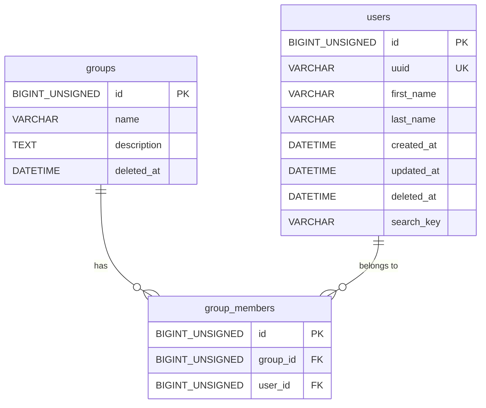

# Schema

## 概要

| 項目             | 内容                                                                                                    |
| ---------------- | ------------------------------------------------------------------------------------------------------- |
| システム名       | sample-api                                                                                              |
| 目的・用途       | spec-to-dev-workflow リポジトリのバックエンド API リファレンス実装。Clean Architecture パターンの実証用 |
| RDBMS            | MySQL                                                                                                   |
| バージョン       | {要確認}（Docker Compose で管理）                                                                       |
| ドキュメント種別 | 手書き                                                                                                  |
| 最終更新日       | 2026-04-15                                                                                              |

---

## テーブル一覧

| テーブル名      | 概要                                                                 | 集約単位                     |
| --------------- | -------------------------------------------------------------------- | ---------------------------- |
| `groups`        | グループを表すルートエンティティ。名前・説明を持ちソフトデリート運用 | グループ集約のルート         |
| `group_members` | グループとユーザーの中間テーブル。group_id と user_id で紐付く       | グループ集約の子エンティティ |
| `users`         | ユーザーを表すエンティティ。名（first_name）・姓（last_name）を持ちソフトデリート運用 | ユーザー集約のルート         |

---

## テーブル定義

### `groups`

**概要**: グループを表す。名前・説明を持ち、`deleted_at` によるソフトデリート運用。

**集約単位**: グループ集約のルートエンティティ

#### カラム

| カラム名      | データ型          | NULL     | デフォルト     | 説明                                          |
| ------------- | ----------------- | -------- | -------------- | --------------------------------------------- |
| `id`          | `BIGINT UNSIGNED` | NOT NULL | AUTO_INCREMENT | グループの識別子（主キー）                    |
| `name`        | `VARCHAR(255)`    | NOT NULL | なし           | グループ名                                    |
| `description` | `TEXT`            | NOT NULL | なし           | グループの説明                                |
| `deleted_at`  | `DATETIME`        | NULL     | なし           | 論理削除日時。NULL = 有効、非 NULL = 削除済み |

#### 制約

| 種別        | 名前      | 対象カラム | 説明                 |
| ----------- | --------- | ---------- | -------------------- |
| PRIMARY KEY | `PRIMARY` | `id`       | グループの一意識別子 |

#### インデックス

| インデックス名      | 対象カラム           | 種別    | 用途                                        |
| ------------------- | -------------------- | ------- | ------------------------------------------- |
| `PRIMARY`           | `id`                 | PRIMARY | 主キーアクセス                              |
| `idx_groups_active` | `(deleted_at, id)` | INDEX   | 有効グループ取得の高速化（deleted_at IS NULL 検索） |

---

### `group_members`

**概要**: グループとユーザーの中間テーブル。`group_id` で `groups` と、`user_id` で `users` と紐付く。

**集約単位**: グループ集約の子エンティティ

#### カラム

| カラム名   | データ型          | NULL     | デフォルト     | 説明                                      |
| ---------- | ----------------- | -------- | -------------- | ----------------------------------------- |
| `id`       | `BIGINT UNSIGNED` | NOT NULL | AUTO_INCREMENT | 中間テーブルの識別子（主キー）            |
| `group_id` | `BIGINT UNSIGNED` | NOT NULL | なし           | 所属するグループの ID（FK → `groups.id`） |
| `user_id`  | `BIGINT UNSIGNED` | NOT NULL | なし           | 所属するユーザーの ID（FK → `users.id`）  |

> **注意**: 現在の migration（`20260403120000_create_tables.up.sql`）では初期から `user_id` FK を持つ構成で作成されている。

#### 制約

| 種別        | 名前                           | 対象カラム                | 説明                                                   |
| ----------- | ------------------------------ | ------------------------- | ------------------------------------------------------ |
| PRIMARY KEY | `PRIMARY`                      | `id`                      | 中間テーブルの一意識別子                               |
| FOREIGN KEY | `fk_group_members_group_id`    | `group_id` → `groups(id)` | 所属グループの参照整合性を保証                         |
| FOREIGN KEY | `fk_group_members_user_id`     | `user_id` → `users(id)`   | 所属ユーザーの参照整合性を保証                         |
| UNIQUE      | `uq_group_members_group_user`  | `(group_id, user_id)`     | 同一グループへの重複メンバー登録を防止（重複 INSERT → 409） |

#### インデックス

| インデックス名                  | 対象カラム          | 種別    | 用途                                                                                           |
| ------------------------------- | ------------------- | ------- | ---------------------------------------------------------------------------------------------- |
| `PRIMARY`                       | `id`                | PRIMARY | 主キーアクセス                                                                                 |
| `uq_group_members_group_user`   | `(group_id, user_id)` | UNIQUE | 重複防止 + `group_id` leftmost prefix でグループ別メンバー取得の高速化も兼ねる               |
| `idx_group_members_user_id`     | `user_id`           | INDEX   | ユーザー別グループ取得の高速化                                                                 |

> **注意**: `idx_group_members_group_id` は `uq_group_members_group_user` の leftmost prefix と重複するため作成されていない。

---

### `users`

**概要**: ユーザーを表す。名（first_name）・姓（last_name）を持ち、`deleted_at` によるソフトデリート運用。`search_key` は検索用 VIRTUAL GENERATED COLUMN。

**集約単位**: ユーザー集約のルートエンティティ

#### カラム

| カラム名     | データ型          | NULL     | デフォルト                                        | 説明                                                                                   |
| ------------ | ----------------- | -------- | ------------------------------------------------- | -------------------------------------------------------------------------------------- |
| `id`         | `BIGINT UNSIGNED` | NOT NULL | AUTO_INCREMENT                                    | ユーザーの識別子（主キー）                                                             |
| `uuid`       | `VARCHAR(36)`     | NOT NULL | なし                                              | ユーザーの UUID。外部公開用識別子（`GET /api/v1/me` の `sub` クレームに対応）          |
| `first_name` | `VARCHAR(255)`    | NOT NULL | なし                                              | 名                                                                                     |
| `last_name`  | `VARCHAR(255)`    | NOT NULL | なし                                              | 姓                                                                                     |
| `created_at` | `DATETIME`        | NOT NULL | CURRENT_TIMESTAMP                                 | 作成日時                                                                               |
| `updated_at` | `DATETIME`        | NOT NULL | CURRENT_TIMESTAMP ON UPDATE CURRENT_TIMESTAMP     | 更新日時                                                                               |
| `deleted_at` | `DATETIME`        | NULL     | なし                                              | 論理削除日時。NULL = 有効、非 NULL = 削除済み                                          |
| `search_key` | `VARCHAR(510)`    | —        | GENERATED                                         | 検索用仮想カラム。`CONCAT(first_name, last_name, last_name, first_name)` で自動生成。名前・姓順の両方向検索に対応 |

> **`search_key` VIRTUAL GENERATED COLUMN**: 実際にはストレージに保存されず、SELECT 時にのみ計算される。`search_key LIKE '%q%'` で姓名・名姓の両方向検索が可能。将来的に検索対象カラムを追加する場合は、マイグレーションで式を更新する。

#### 制約

| 種別        | 名前             | 対象カラム | 説明                         |
| ----------- | ---------------- | ---------- | ---------------------------- |
| PRIMARY KEY | `PRIMARY`        | `id`       | ユーザーの一意識別子         |
| UNIQUE      | `uq_users_uuid`  | `uuid`     | UUID の一意性を保証          |

#### インデックス

| インデックス名    | 対象カラム          | 種別    | 用途                                      |
| ----------------- | ------------------- | ------- | ----------------------------------------- |
| `PRIMARY`         | `id`                | PRIMARY | 主キーアクセス                            |
| `uq_users_uuid`   | `uuid`              | UNIQUE  | `GetByUUID` での高速検索                  |
| `idx_users_active` | `(deleted_at, id)` | INDEX   | 有効ユーザー取得の高速化（deleted_at IS NULL 検索） |

---

## 暗黙のルール

### 論理削除ポリシー

- `groups` テーブルは `deleted_at` カラム（`DATETIME NULL`）を持ち、ソフトデリート運用
- 有効レコードの取得条件: `WHERE deleted_at IS NULL`
- 物理削除は原則禁止
- `group_members` テーブルには `deleted_at` がなく、論理削除非対応（グループ削除時のカスケード挙動は {要確認}）
- `users` テーブルも `deleted_at` カラム（`DATETIME NULL`）を持ち、ソフトデリート運用（`group_members` 取得時は `users.deleted_at IS NULL` 条件が必要）

### その他の暗黙ルール

- 文字コード・照合順序は {要確認}（Docker Compose の MySQL 設定に依存）
- タイムゾーンは {要確認}

---

## データのライフサイクル・保存期間

| テーブル        | 保存期間 | 削除方針                                      |
| --------------- | -------- | --------------------------------------------- |
| `groups`        | 無期限   | 論理削除（`deleted_at` による）               |
| `group_members` | 無期限   | {要確認}（物理削除 / グループに連動の可能性） |
| `users`         | 無期限   | 論理削除（`deleted_at` による）               |

---

## データのソース・ユースケース

| テーブル        | データソース                                                               | 主なユースケース                                                                                          |
| --------------- | -------------------------------------------------------------------------- | --------------------------------------------------------------------------------------------------------- |
| `groups`        | API 経由（ユーザー操作） / シードデータ（`db/seed/seed.sql`） | `GET /api/v1/groups` — グループ一覧取得 / `GET /api/v1/groups/:id` — グループ詳細取得                     |
| `group_members` | API 経由（ユーザー操作） / シードデータ（`db/seed/seed.sql`） | `GET /api/v1/groups` — メンバー数集計 / `GET /api/v1/groups/:id/members` — メンバー一覧取得（users JOIN） |
| `users`         | API 経由（ユーザー操作） / シードデータ（`db/seed/seed.sql`） | `GET /api/v1/users` — ユーザー一覧取得（`search_key LIKE` 検索） `GET /api/v1/groups/:id/members` — メンバー情報取得（group_members JOIN） `GET /api/v1/groups/:id/non-members` — 未所属ユーザー取得（`search_key LIKE` 検索） |

---

## 更新ポリシー

| テーブル        | 更新方式               | 備考                                                        |
| --------------- | ---------------------- | ----------------------------------------------------------- |
| `groups`        | オンライン（API 経由） | SELECT / INSERT / UPDATE / DELETE（論理削除）すべて実装済み |
| `group_members` | オンライン（API 経由） | SELECT（JOIN）と `POST /api/v1/groups/:id/members` による INSERT が実装済み |
| `users`         | オンライン（API 経由） | `GET /api/v1/users` による SELECT 実装済み。直接の INSERT / UPDATE / DELETE API は未実装 |

---

## マイグレーション

| 項目                 | 内容                                                                              |
| -------------------- | --------------------------------------------------------------------------------- |
| ツール               | golang-migrate                                                                    |
| ファイル置き場       | `sample-api/db/migrate/`                                                          |
| ファイル命名規則     | `YYYYMMDDHHMMSS_{table_name}.up.sql`（例: `20260403120000_create_tables.up.sql`） |
| 適用コマンド         | `make db-migrate`                                                                 |
| ロールバックコマンド | `make db-reset`（開発環境限定、`APP_ENV=development` が必要）                     |

### マイグレーションファイル一覧

| ファイル                                                                         | 内容                                                                           |
| -------------------------------------------------------------------------------- | ------------------------------------------------------------------------------ |
| `sample-api/db/migrate/20260403120000_create_tables.up.sql`                      | `groups` / `users` / `group_members` テーブル定義（統合）                      |
| `sample-api/db/migrate/20260411120000_add_search_key_to_users.up.sql`            | `users` テーブルへの `search_key` VIRTUAL GENERATED COLUMN 追加（add-group-member） |
| `sample-api/db/migrate/20260415120000_add_uuid_to_users.up.sql`                  | `users` テーブルへの `uuid` カラム追加・既存レコードへ UUID 自動生成（auth/login） |

### シードデータファイル一覧

| ファイル                        | 内容                                                           |
| ------------------------------- | -------------------------------------------------------------- |
| `sample-api/db/seed/seed.sql`   | groups / users / group_members のシードデータ（FK 依存順に記載） |

---

## テーブル間の関連

---

## ドキュメント管理

| 項目             | 内容                             |
| ---------------- | -------------------------------- |
| 管理方法         | 手書き                           |
| 自動生成ツール   | なし                             |
| 自動生成コマンド | なし                             |
| スクリプト置き場 | なし                             |
| 更新ルール       | マイグレーション追加時に手動更新 |
