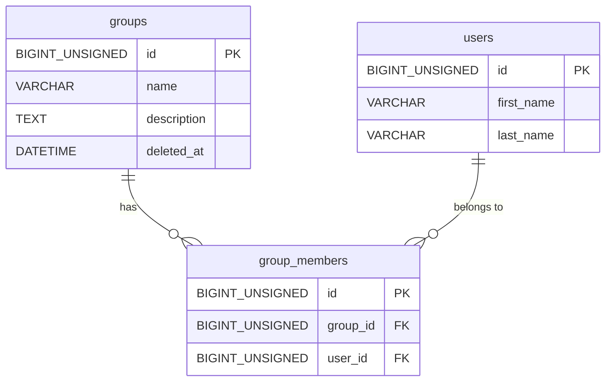

# Schema

## 概要

| 項目 | 内容 |
|---|---|
| システム名 | sample-api |
| 目的・用途 | spec-to-dev-workflow リポジトリのバックエンド API リファレンス実装。Clean Architecture パターンの実証用 |
| RDBMS | MySQL |
| バージョン | {要確認}（Docker Compose で管理） |
| ドキュメント種別 | 手書き |
| 最終更新日 | 2026-04-03 |

---

## テーブル一覧

| テーブル名 | 概要 | 集約単位 |
|---|---|---|
| `groups` | グループを表すルートエンティティ。名前・説明を持ちソフトデリート運用 | グループ集約のルート |
| `group_members` | グループとユーザーの中間テーブル。group_id と user_id で紐付く | グループ集約の子エンティティ |
| `users` | ユーザーを表すエンティティ。名（first_name）・姓（last_name）を持つ | ユーザー集約のルート |

---

## テーブル定義

### `groups`

**概要**: グループを表す。名前・説明を持ち、`deleted_at` によるソフトデリート運用。

**集約単位**: グループ集約のルートエンティティ

#### カラム

| カラム名 | データ型 | NULL | デフォルト | 説明 |
|---|---|---|---|---|
| `id` | `BIGINT UNSIGNED` | NOT NULL | AUTO_INCREMENT | グループの識別子（主キー） |
| `name` | `VARCHAR(255)` | NOT NULL | なし | グループ名 |
| `description` | `TEXT` | NOT NULL | なし | グループの説明 |
| `deleted_at` | `DATETIME` | NULL | なし | 論理削除日時。NULL = 有効、非 NULL = 削除済み |

#### 制約

| 種別 | 名前 | 対象カラム | 説明 |
|---|---|---|---|
| PRIMARY KEY | `PRIMARY` | `id` | グループの一意識別子 |

#### インデックス

| インデックス名 | 対象カラム | 種別 | 用途 |
|---|---|---|---|
| `PRIMARY` | `id` | PRIMARY | 主キーアクセス |

---

### `group_members`

**概要**: グループとユーザーの中間テーブル。`group_id` で `groups` と、`user_id` で `users` と紐付く。

**集約単位**: グループ集約の子エンティティ

#### カラム

| カラム名 | データ型 | NULL | デフォルト | 説明 |
|---|---|---|---|---|
| `id` | `BIGINT UNSIGNED` | NOT NULL | AUTO_INCREMENT | 中間テーブルの識別子（主キー） |
| `group_id` | `BIGINT UNSIGNED` | NOT NULL | なし | 所属するグループの ID（FK → `groups.id`） |
| `user_id` | `BIGINT UNSIGNED` | NOT NULL | なし | 所属するユーザーの ID（FK → `users.id`） |

> **注意**: migration `003` にて `name` カラムを削除し `user_id` FK を追加。既存シードデータの更新が必要。

#### 制約

| 種別 | 名前 | 対象カラム | 説明 |
|---|---|---|---|
| PRIMARY KEY | `PRIMARY` | `id` | 中間テーブルの一意識別子 |
| FOREIGN KEY | `group_members_ibfk_1` | `group_id` → `groups(id)` | 所属グループの参照整合性を保証 |
| FOREIGN KEY | `group_members_ibfk_2` | `user_id` → `users(id)` | 所属ユーザーの参照整合性を保証 |

#### インデックス

| インデックス名 | 対象カラム | 種別 | 用途 |
|---|---|---|---|
| `PRIMARY` | `id` | PRIMARY | 主キーアクセス |
| `idx_group_members_group_id` | `group_id` | INDEX | グループ別メンバー取得の高速化 |
| `idx_group_members_user_id` | `user_id` | INDEX | ユーザー別グループ取得の高速化 |

---

### `users`

**概要**: ユーザーを表す。名（first_name）・姓（last_name）を持つ。

**集約単位**: ユーザー集約のルートエンティティ

#### カラム

| カラム名 | データ型 | NULL | デフォルト | 説明 |
|---|---|---|---|---|
| `id` | `BIGINT UNSIGNED` | NOT NULL | AUTO_INCREMENT | ユーザーの識別子（主キー） |
| `first_name` | `VARCHAR(255)` | NOT NULL | なし | 名 |
| `last_name` | `VARCHAR(255)` | NOT NULL | なし | 姓 |

#### 制約

| 種別 | 名前 | 対象カラム | 説明 |
|---|---|---|---|
| PRIMARY KEY | `PRIMARY` | `id` | ユーザーの一意識別子 |

#### インデックス

| インデックス名 | 対象カラム | 種別 | 用途 |
|---|---|---|---|
| `PRIMARY` | `id` | PRIMARY | 主キーアクセス |

---

## 暗黙のルール

### 論理削除ポリシー

- `groups` テーブルは `deleted_at` カラム（`DATETIME NULL`）を持ち、ソフトデリート運用
- 有効レコードの取得条件: `WHERE deleted_at IS NULL`
- 物理削除は原則禁止
- `group_members` テーブルには `deleted_at` がなく、論理削除非対応（グループ削除時のカスケード挙動は {要確認}）
- `users` テーブルには `deleted_at` がなく、論理削除非対応

### その他の暗黙ルール

- 文字コード・照合順序は {要確認}（Docker Compose の MySQL 設定に依存）
- タイムゾーンは {要確認}

---

## データのライフサイクル・保存期間

| テーブル | 保存期間 | 削除方針 |
|---|---|---|
| `groups` | 無期限 | 論理削除（`deleted_at` による） |
| `group_members` | 無期限 | {要確認}（物理削除 / グループに連動の可能性） |
| `users` | 無期限 | 物理削除（`deleted_at` なし） |

---

## データのソース・ユースケース

| テーブル | データソース | 主なユースケース |
|---|---|---|
| `groups` | API 経由（ユーザー操作） / シードデータ（`002_seed_groups.sql`） | `GET /api/v1/groups` — グループ一覧取得 / `GET /api/v1/groups/:id` — グループ詳細取得 |
| `group_members` | API 経由（ユーザー操作） / シードデータ（`002_seed_groups.sql`） | `GET /api/v1/groups` — メンバー数集計 / `GET /api/v1/groups/:id/members` — メンバー一覧取得（users JOIN） |
| `users` | API 経由（ユーザー操作） / シードデータ（`003_create_users_and_update_group_members.sql`） | `GET /api/v1/groups/:id/members` — メンバー情報取得（group_members JOIN） |

---

## 更新ポリシー

| テーブル | 更新方式 | 備考 |
|---|---|---|
| `groups` | オンライン（API 経由） | 現時点は SELECT のみ実装。INSERT / UPDATE / DELETE は未実装 |
| `group_members` | オンライン（API 経由） | SELECT（JOIN）のみ。直接操作 API は未実装 |
| `users` | オンライン（API 経由） | SELECT（group_members JOIN）のみ。直接操作 API は未実装 |

---

## マイグレーション

| 項目 | 内容 |
|---|---|
| ツール | {要確認}（番号付き SQL ファイルによる管理） |
| ファイル置き場 | `sample-api/db/migrations/` |
| ファイル命名規則 | `NNN_動詞_対象テーブル.sql`（例: `001_create_groups_tables.sql`） |
| 適用コマンド | {要確認} |
| ロールバックコマンド | {要確認} |

### マイグレーションファイル一覧

| ファイル | 内容 |
|---|---|
| `sample-api/db/migrations/001_create_groups_tables.sql` | `groups` / `group_members` テーブル定義 |
| `sample-api/db/migrations/002_seed_groups.sql` | グループ 30 件・メンバーのシードデータ |
| `sample-api/db/migrations/003_create_users_and_update_group_members.sql` | `users` テーブル作成・`group_members` に `user_id` FK 追加・`name` カラム削除 |

---

## テーブル間の関連

---

## ドキュメント管理

| 項目 | 内容 |
|---|---|
| 管理方法 | 手書き |
| 自動生成ツール | なし |
| 自動生成コマンド | なし |
| スクリプト置き場 | なし |
| 更新ルール | マイグレーション追加時に手動更新 |
