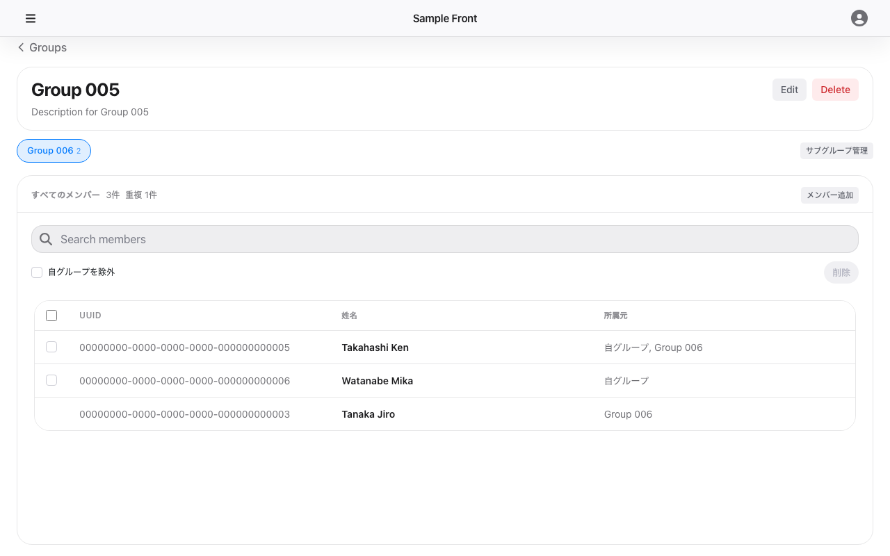

# group-detail — 画面仕様

## 目的・役割

特定のグループの詳細情報とそのメンバー一覧を確認する画面。グループの名称・説明を表示し、所属メンバーを検索・無限スクロール付きで閲覧できる。

レイアウトは縦 1 列で構成され、グループヘッダー直下のフィルターチップ行でサブグループごとにメンバー一覧をフィルタリングできる。サブグループの追加・閲覧・削除はチップ行右端の「サブグループ管理」ボタンから開くシート（SubgroupManagementSheet）に集約されている。

この画面には **2 つの表示モード** がある：

| モード           | トリガー                             | 表示形式                                                         |
| ---------------- | ------------------------------------ | ---------------------------------------------------------------- |
| シートモード     | グループ一覧からグループ行をクリック | 右からスライドインするシート（オーバーレイ）。背後に一覧が見える |
| フルページモード | `/groups/:id` に直接アクセス         | 従来どおりのフルページ表示                                       |

---

## 識別情報

| 項目         | 内容                 |
| ------------ | -------------------- |
| 画面タイトル | {グループ名}（動的） |
| 画面 ID      | group-detail         |
| URL / パス   | `/groups/:id`        |

---

## 想定利用者

| 項目               | 内容                                                                                    |
| ------------------ | --------------------------------------------------------------------------------------- |
| 対象ユーザー       | 認証済みユーザー                                                                        |
| 必要な権限・ロール | `GET /api/v1/me` が 200 を返すこと                                                      |
| アクセス制御       | ProtectedRoute でガード済み。未認証・API 障害時は `/service-unavailable` へリダイレクト |

---

## 画面



---

## レイアウトと主要パーツ

シートモード・フルページモード共通で **縦 1 列レイアウト** を採用する。上から順に「グループ情報カード → フィルターチップ行 → メンバーセクション」が並び、サブグループの追加・削除は「サブグループ管理」ボタンから開くシートに集約される。

### シートモード（グループ一覧からの遷移）

| パーツ                             | 役割                                                                                                                                                                                                                                            |
| ---------------------------------- | ----------------------------------------------------------------------------------------------------------------------------------------------------------------------------------------------------------------------------------------------- |
| ↔ ボタン（右上・閉じるボタンの左） | シートを閉じてフルページ（`/groups/:id`）に展開する                                                                                                                                                                                             |
| > ボタン（右上・FaChevronRight）   | シートを閉じてグループ一覧画面へ戻る                                                                                                                                                                                                            |
| グループ情報カード                 | グループの名称・説明を表示する                                                                                                                                                                                                                  |
| [Edit] ボタン                      | グループ情報編集ダイアログを開く                                                                                                                                                                                                                |
| [Delete] ボタン                    | グループ削除確認ダイアログを開く                                                                                                                                                                                                                |
| フィルターチップ行                 | グループヘッダー直下に配置する横スクロール領域。サブグループごとにチップ（名前 + メンバー数）を 1 つ描画し、クリックで ON/OFF をトグルする。サブグループ 0 件時はチップ部分を描画せず「サブグループ管理」ボタンのみ表示する                     |
| サブグループ管理ボタン             | フィルターチップ行右端に固定表示される pill ボタン。クリックで SubgroupManagementSheet が `useSheetStack` でシートとして開く                                                                                                                    |
| メンバーセクションタイトル         | フィルターチップ行直下のセクションヘッダー。「すべてのメンバー」を表示する                                                                                                                                                                      |
| メンバー総件数バッジ               | サーバー集計の重複除外済み件数（`apiTotal`）を「N件」で表示する。フィルター変化時は古い値を 300ms 維持し、次のフェッチ完了時に新しい値で更新される。初期表示時のみ `member_count + 選択中サブグループのメンバー数合計` をフォールバック表示する |
| 重複件数バッジ                     | 2 つ以上の group / subgroup に所属するユニークユーザー数を「重複 N件」で表示する（BE の `duplicate_count`）。0 のとき非表示。フィルター変化時は古い値を 300ms 維持し、次のフェッチ完了時に新しい値で更新される                                  |
| メンバー追加ボタン                 | 「メンバー追加」ボタン。クリックで AddMemberSheet が表示される                                                                                                                                                                                  |
| メンバー検索ボックス               | キーワードでメンバーを名前で絞り込む                                                                                                                                                                                                            |
| メンバーリスト（クリック可能）     | □選択 / uuid / 姓名 / 所属元 の 4 列テーブル形式でメンバーを一覧表示する。親直属メンバー行のみチェックボックスが表示され、名前セルクリックで MemberDetailSheet が開く。子孫由来行はチェックボックスなし・クリック無効                           |
| ヘッダーチェックボックス           | テーブルヘッダー左端の全選択チェックボックス。クリックで全選択 / 全解除。一部選択時は indeterminate 表示                                                                                                                                        |
| メンバー行チェックボックス         | 各メンバー行に表示されるチェックボックス。削除対象を選択するために使用する                                                                                                                                                                      |
| 削除ボタン                         | 「削除」ボタン。1 件以上チェックされている場合に enabled になる。クリックで削除確認 AlertDialog が表示される                                                                                                                                    |
| センチネル要素                     | リスト末尾に配置された不可視要素。viewport に入ると次バッチの自動フェッチを開始する                                                                                                                                                             |

### フルページモード（直接 URL アクセス）

| パーツ                     | 役割                                                                                                                                                                                                                    |
| -------------------------- | ----------------------------------------------------------------------------------------------------------------------------------------------------------------------------------------------------------------------- |
| 戻るボタン（< Groups）     | グループ一覧画面（`/`）へ戻る                                                                                                                                                                                           |
| グループ情報カード         | グループの名称・説明を表示する                                                                                                                                                                                          |
| [Edit] ボタン              | グループ情報編集ダイアログを開く                                                                                                                                                                                        |
| [Delete] ボタン            | グループ削除確認ダイアログを開く                                                                                                                                                                                        |
| フィルターチップ行         | シートモードと同等。サブグループの ON/OFF トグル + 「サブグループ管理」ボタン                                                                                                                                           |
| サブグループ管理ボタン     | クリックで SubgroupManagementSheet を開く                                                                                                                                                                               |
| メンバーセクションタイトル | 「すべてのメンバー」を表示する                                                                                                                                                                                          |
| メンバー総件数バッジ       | 重複除外済み件数（`apiTotal`）を「N件」で表示する。フィルター変化時は古い値を 300ms 維持し、次のフェッチ完了時に更新される。初期表示時のみ `member_count + 選択中サブグループのメンバー数合計` をフォールバック表示する |
| 重複件数バッジ             | 2 つ以上の group / subgroup に所属するユニークユーザー数（`duplicate_count`）を「重複 N件」で表示する。0 のとき非表示。フィルター変化時は古い値を 300ms 維持し、次のフェッチ完了時に更新される                          |
| メンバー追加ボタン         | クリックで AddMemberSheet が表示される                                                                                                                                                                                  |
| メンバー検索ボックス       | キーワードでメンバーを名前で絞り込む                                                                                                                                                                                    |
| メンバーリスト             | □選択 / uuid / 姓名 / 所属元 の 4 列テーブル形式でメンバーを一覧表示する。親直属メンバー行のみチェックボックスが有効                                                                                                    |
| ヘッダーチェックボックス   | テーブルヘッダー左端の全選択チェックボックス。クリックで全選択 / 全解除。一部選択時は indeterminate 表示                                                                                                                |
| メンバー行チェックボックス | 各メンバー行に表示されるチェックボックス。削除対象を選択するために使用する                                                                                                                                              |
| 削除ボタン                 | 「削除」ボタン。1 件以上チェックされている場合に enabled になる。クリックで削除確認 AlertDialog が表示される                                                                                                            |
| センチネル要素             | リスト末尾に配置された不可視要素。viewport に入ると次バッチの自動フェッチを開始する                                                                                                                                     |

---

## 操作手順

### シートモード（グループ一覧からの遷移）

1. グループ一覧からグループ行をクリックする → グループ詳細シートが右からスライドインして表示される
2. グループの名称・説明が表示される。メンバー一覧がロードされてリストに表示される
3. フィルターチップ行をスクロールしてサブグループのチップを確認する。初期状態では全チップ ON（青塗り）
4. チップをクリックする → ON/OFF がトグルされ、`excludeGroupIds` に反映されて 300ms デバウンス後にメンバー一覧が再フェッチされる
5. メンバー検索ボックスにキーワードを入力する → メンバーが名前で絞り込まれる
6. リストをスクロールして末尾に到達する → センチネル要素が viewport に入り、次バッチが自動でロードされる
7. メンバー行をクリックする → MemberDetailSheet がシートの上にスタックされて表示される
8. 「メンバー追加」ボタンをクリックする → AddMemberSheet が新たなシートとして積まれ、未所属ユーザー一覧が表示される
9. ヘッダーチェックボックスをクリックする → 全メンバーが一括選択され「削除」ボタンが enabled になる（個別チェックでも同様に選択可能）
10. 「削除」ボタンをクリックする → 削除確認 AlertDialog が表示される（「選択した N 名をグループから削除しますか？」）
11. ダイアログの「削除する」をクリックする → メンバーが削除され、メンバー数と一覧が更新される
12. 「サブグループ管理」ボタンをクリックする → SubgroupManagementSheet が `useSheetStack` でスタックされて表示される
13. SubgroupManagementSheet の「＋ 追加」ボタンをクリックする → AddSubgroupSheet がさらにスタックされて表示される
14. SubgroupManagementSheet のサブグループ行の「削除」ボタンをクリックする → DeleteSubgroupDialog が開く。Delete 確認でサブグループ関係が解除され、フィルターチップ行とメンバー一覧が更新される
15. > ボタンを押す / ESC キーを押す / シート外（左端エリア）をクリックする → 最前面のシートから順に右へスライドアウトして閉じる
16. ヘッダーの ↔ ボタンを押す → シートが消えてフルページ（`/groups/:id`）に展開される。ブラウザ戻るで一覧に戻る

### フルページモード（直接 URL アクセス）

1. `/groups/:id` に直接アクセスする → フルページでグループ詳細が表示される
2. グループの名称・説明が表示される。メンバー一覧がリストに表示される
3. フィルターチップ行のチップで ON/OFF を切り替えると `excludeGroupIds` に反映され、300ms デバウンス後にメンバー一覧が再フェッチされる
4. メンバー検索ボックスにキーワードを入力する → メンバーが名前で絞り込まれる
5. リストをスクロールして末尾に到達する → センチネル要素が viewport に入り、次バッチが自動でロードされる
6. 「メンバー追加」ボタンをクリックする → AddMemberSheet が表示され、未所属ユーザー一覧が描画される
7. ヘッダーチェックボックスをクリックする → 全メンバーが一括選択され「削除」ボタンが enabled になる（個別チェックでも同様に選択可能）
8. 「削除」ボタンをクリックする → 削除確認 AlertDialog が表示される（「選択した N 名をグループから削除しますか？」）
9. ダイアログの「削除する」をクリックする → メンバーが削除され、メンバー数と一覧が更新される
10. 「サブグループ管理」ボタンをクリックする → SubgroupManagementSheet がシートとして表示される
11. SubgroupManagementSheet の「＋ 追加」ボタンで AddSubgroupSheet を、サブグループ行の「削除」ボタンで DeleteSubgroupDialog を開ける
12. 「< Groups」ボタンを押す → グループ一覧画面（`/`）へ遷移する

---

## ボタン・リンクの機能

### シートモード

| ボタン / リンク                                  | 操作後の動作                                                                                                              |
| ------------------------------------------------ | ------------------------------------------------------------------------------------------------------------------------- |
| ↔ ボタン（右上・TbArrowsHorizontal）             | シートを閉じてフルページ（`/groups/:id`）に展開する。ブラウザ戻るで一覧に戻る                                             |
| > ボタン（右上・FaChevronRight）                 | シートを閉じる（右へスライドアウト）                                                                                      |
| ESC キー                                         | 最前面のシートを閉じる                                                                                                    |
| シート外エリア（左端）クリック                   | 最前面のシートを閉じる                                                                                                    |
| [Edit] ボタン                                    | グループ情報編集ダイアログを開く                                                                                          |
| [Delete] ボタン                                  | グループ削除確認ダイアログ（AlertDialog）を開く                                                                           |
| フィルターチップ                                 | クリックで該当サブグループの ON/OFF をトグル。`excludeGroupIds` に反映し 300ms デバウンス後にメンバー一覧を再フェッチする |
| サブグループ管理ボタン                           | SubgroupManagementSheet を `useSheetStack` でスタックして表示                                                             |
| メンバー検索ボックス（入力）                     | メンバーを名前で絞り込む                                                                                                  |
| メンバー行（クリック）                           | MemberDetailSheet をシートスタックに積む                                                                                  |
| メンバー追加                                     | AddMemberSheet をシートスタックに積む（2 枚目以降のシートとして表示）                                                     |
| ヘッダーチェックボックス                         | クリックで全選択 / 全解除。一部選択時は indeterminate 表示。メンバー 0 件時は disabled                                    |
| メンバー行チェックボックス                       | チェックを入れると「削除」ボタンが enabled になる                                                                         |
| 削除（チェックあり）                             | 削除確認 AlertDialog を開く                                                                                               |
| 削除する（AlertDialog 内）                       | DELETE リクエストを送信。成功後にメンバー一覧と member_count を更新する                                                   |
| キャンセル（AlertDialog 内）                     | AlertDialog を閉じる。チェック状態は維持される                                                                            |
| ＋ 追加（SubgroupManagementSheet 内）            | AddSubgroupSheet をシートスタックに積む（サブグループ管理シートの上に重ねる）                                             |
| 削除（SubgroupManagementSheet のサブグループ行） | DeleteSubgroupDialog を開く                                                                                               |
| Delete（DeleteSubgroupDialog 内）                | DELETE /api/v1/groups/:id/subgroups/:childId を送信。成功後にサブグループ一覧・フィルターチップ行・メンバー一覧を更新する |
| Cancel（DeleteSubgroupDialog 内）                | AlertDialog を閉じる。エラーメッセージもクリアされる                                                                      |

### フルページモード

| ボタン / リンク                                  | 操作後の動作                                                                                                              |
| ------------------------------------------------ | ------------------------------------------------------------------------------------------------------------------------- |
| < Groups（戻るボタン）                           | グループ一覧画面（`/`）へ遷移する                                                                                         |
| [Edit] ボタン                                    | グループ情報編集ダイアログを開く                                                                                          |
| [Delete] ボタン                                  | グループ削除確認ダイアログ（AlertDialog）を開く                                                                           |
| フィルターチップ                                 | クリックで ON/OFF トグル。`excludeGroupIds` に反映し 300ms デバウンス後にメンバー一覧を再フェッチする                     |
| サブグループ管理ボタン                           | SubgroupManagementSheet を表示する                                                                                        |
| メンバー検索ボックス（入力）                     | メンバーを名前で絞り込む                                                                                                  |
| メンバー追加                                     | AddMemberSheet を表示する                                                                                                 |
| ヘッダーチェックボックス                         | クリックで全選択 / 全解除。一部選択時は indeterminate 表示。メンバー 0 件時は disabled                                    |
| メンバー行チェックボックス                       | チェックを入れると「削除」ボタンが enabled になる                                                                         |
| 削除（チェックあり）                             | 削除確認 AlertDialog を開く                                                                                               |
| 削除する（AlertDialog 内）                       | DELETE リクエストを送信。成功後にメンバー一覧と member_count を更新する                                                   |
| キャンセル（AlertDialog 内）                     | AlertDialog を閉じる。チェック状態は維持される                                                                            |
| ＋ 追加（SubgroupManagementSheet 内）            | AddSubgroupSheet を表示する                                                                                               |
| 削除（SubgroupManagementSheet のサブグループ行） | DeleteSubgroupDialog を開く                                                                                               |
| Delete（DeleteSubgroupDialog 内）                | DELETE /api/v1/groups/:id/subgroups/:childId を送信。成功後にサブグループ一覧・フィルターチップ行・メンバー一覧を更新する |
| Cancel（DeleteSubgroupDialog 内）                | AlertDialog を閉じる。エラーメッセージもクリアされる                                                                      |

---

## 画面遷移

| 遷移元                                   | 遷移先                                        | トリガー                             | 表示形式                                          |
| ---------------------------------------- | --------------------------------------------- | ------------------------------------ | ------------------------------------------------- |
| グループ一覧（group-list）               | この画面（group-detail）シートモード          | グループ行をクリック                 | シートが右からスライドイン                        |
| この画面（group-detail）シートモード     | グループ一覧（group-list）                    | > ボタン / ESC / シート外クリック    | シートが右へスライドアウト                        |
| この画面（group-detail）シートモード     | この画面（group-detail）フルページモード      | ↔ ボタンをクリック                   | シートが消えてフルページに展開（`replace: true`） |
| この画面（group-detail）シートモード     | MemberDetailSheet（シート上にスタック）       | メンバー行をクリック                 | 追加シートが右からスライドイン                    |
| この画面（group-detail）                 | SubgroupManagementSheet（シート上にスタック） | 「サブグループ管理」ボタンをクリック | シートが右からスライドイン                        |
| SubgroupManagementSheet                  | AddSubgroupSheet（シート上にスタック）        | 「＋ 追加」ボタンをクリック          | さらにシートをスタックして右からスライドイン      |
| 直接 URL アクセス                        | この画面（group-detail）フルページモード      | `/groups/:id` に直接遷移             | フルページ表示                                    |
| この画面（group-detail）フルページモード | グループ一覧（group-list）                    | 「< Groups」戻るボタンをクリック     | ページ遷移                                        |
| この画面（group-detail）フルページモード | グループ一覧（group-list）`/`                 | グループ削除成功（[Delete] 確認後）  | ページ遷移                                        |

---

## 入力項目

| 項目名                 | 必須 / 任意 | 形式・制約                         |
| ---------------------- | ----------- | ---------------------------------- |
| メンバー検索キーワード | 任意        | 自由テキスト。名前（姓・名）が対象 |

---

## 前提条件・制約

- ProtectedRoute でガードされている。`GET /api/v1/me` の認証が必要
- URL パラメータ `:id` でグループを特定する
- メンバー一覧は 100 件単位（FETCH_LIMIT=100）でフェッチしてキャッシュし、リスト末尾のセンチネル要素が viewport に入ると自動で次バッチをフェッチする（無限スクロール）

---

## エラー・注意事項

| エラー / 注意                       | 内容                                                                                                                                  |
| ----------------------------------- | ------------------------------------------------------------------------------------------------------------------------------------- |
| グループ情報の取得失敗              | エラーメッセージが画面に表示される。グループ情報・メンバー一覧は空のまま                                                              |
| メンバー一覧の取得失敗              | エラーメッセージがメンバーセクションに表示される                                                                                      |
| 存在しないグループ ID               | エラーメッセージが表示される                                                                                                          |
| グループ削除の失敗（404 / 500）     | 削除確認ダイアログ内にエラーメッセージが表示される。ダイアログは開いたまま                                                            |
| 未所属ユーザー一覧の取得失敗（5xx） | AddMemberSheet 内にエラーメッセージが表示される。シートは開いたまま                                                                   |
| メンバー追加で 409 Conflict         | AddMemberSheet 内に「選択したユーザーはすでにメンバーです」が表示される。シートは開いたまま                                           |
| 未所属ユーザーがいない              | AddMemberSheet 内に「追加できるユーザーがいません。」が表示される                                                                     |
| メンバー削除の失敗（4xx・5xx）      | 削除確認 AlertDialog 内にエラーメッセージが表示される。ダイアログは開いたまま                                                         |
| グループ一覧の取得失敗（4xx・5xx）  | AddSubgroupSheet 内にエラーメッセージが表示される。シートは開いたまま                                                                 |
| サブグループ追加で 409 Conflict     | AddSubgroupSheet 内に「すでに追加済みです」が表示される。シートは開いたまま                                                           |
| サブグループ削除で 404 Not Found    | DeleteSubgroupDialog 内に「対象のサブグループ関係が見つかりませんでした」が表示される。ダイアログは開いたまま                         |
| サブグループ削除で 4xx・5xx         | DeleteSubgroupDialog 内に「サブグループの削除に失敗しました。しばらくしてから再度お試しください」が表示される。ダイアログは開いたまま |

---

## 機能一覧

| 機能                 | 概要                                                                                                            | 詳細                                                 |
| -------------------- | --------------------------------------------------------------------------------------------------------------- | ---------------------------------------------------- |
| get-group            | グループの詳細情報（名称・説明・メンバー数・サブグループ一覧）を取得する                                        | [get-group.md](./get-group.md)                       |
| list-group-members   | グループのメンバー一覧を検索・無限スクロール付きで取得する                                                      | [list-group-members.md](./list-group-members.md)     |
| sheet-navigation     | グループ詳細をシートで表示し、メンバー詳細へネストできるシートナビゲーション                                    | [sheet-navigation.md](./sheet-navigation.md)         |
| update-group         | グループの名称・説明を編集ダイアログから更新する                                                                | [update-group.md](./update-group.md)                 |
| delete-group         | グループを削除確認ダイアログからソフトデリートし、一覧へ遷移する                                                | [delete-group.md](./delete-group.md)                 |
| add-group-member     | グループ未所属のユーザーを検索・選択して AddMemberSheet から一括追加する                                        | [add-group-member.md](./add-group-member.md)         |
| add-subgroup         | グループを選択して AddSubgroupSheet からサブグループ（子グループ）として登録する                                | [add-subgroup.md](./add-subgroup.md)                 |
| delete-subgroup      | サブグループ行の [Delete] ボタンから確認ダイアログを経由してサブグループ関係を解除する                          | [delete-subgroup.md](./delete-subgroup.md)           |
| remove-group-members | メンバー一覧のチェックボックスで選択した 1 件または複数件のメンバーを一括削除する（全選択・indeterminate 含む） | [remove-group-members.md](./remove-group-members.md) |

## スクリーンショット設定

```json
{
  "steps": [
    { "goto": "http://localhost:13000/groups/5" },
    { "waitForText": "重複 1件" },
    { "screenshot": "group-detail" }
  ]
}
```
