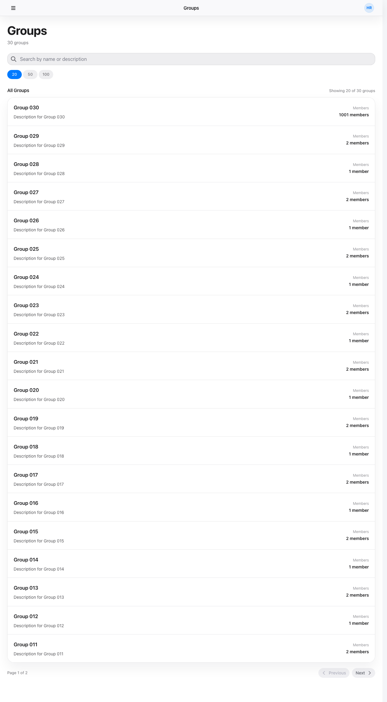

# group-list — 画面仕様

## 目的・役割

システム内のグループを一覧で確認する画面。検索キーワードで絞り込みができ、ページネーションで大量のデータも効率よく閲覧できる。右上の「Create Group」ボタンから新しいグループを作成することもできる。

---

## 識別情報

| 項目 | 内容 |
|---|---|
| 画面タイトル | Groups |
| 画面 ID | group-list |
| URL / パス | `/`（トップページ） |

---

## 想定利用者

| 項目 | 内容 |
|---|---|
| 対象ユーザー | 全ユーザー |
| 必要な権限・ロール | 認証不要 |
| アクセス制御 | 制限なし |

---

## 画面



---

## レイアウトと主要パーツ

| パーツ | 役割 |
|---|---|
| ヒーローセクション | 画面タイトル「Groups」とグループ総件数ラベルを表示する |
| 「Create Group」ボタン | ヘッダー右上に配置。クリックでグループ作成モーダルを開く |
| 検索ボックス | キーワードを入力してグループを名前・説明で絞り込む |
| グループ一覧リスト | 名称・説明・メンバー数をカード形式で一覧表示する。行クリックでグループ詳細へ遷移する |
| 表示件数切替ボタン | 1 ページあたりの表示件数（20 / 50 / 100）を切り替える |
| Previous / Next ボタン | グループ一覧のページを前後に切り替える |
| ページ情報 | 現在のページ番号と総ページ数を表示する |

---

## 操作手順

> この画面は認証不要のため権限分岐なし。

### 共通（全ロール）

1. 画面を開く → グループ一覧がスケルトン表示ののちリストに表示される
2. 検索ボックスにキーワードを入力する → 一覧がリアルタイムで絞り込まれる
3. 表示件数ボタン（20 / 50 / 100）をクリックする → 1 ページの表示件数が切り替わる
4. グループ行をクリックする → グループ詳細画面（`/groups/:id`）へ遷移する
5. 「Next」ボタンを押す → 次のページのグループが表示される
6. 「Previous」ボタンを押す → 前のページのグループが表示される
7. 「Create Group」ボタンをクリックする → グループ作成モーダルが開く

---

## ボタン・リンクの機能

| ボタン / リンク | 操作後の動作 |
|---|---|
| 「Create Group」ボタン | グループ作成モーダルを開く |
| 検索ボックス（入力） | ページを 1 にリセットし、キーワードでグループを絞り込む |
| 表示件数ボタン（20 / 50 / 100） | 1 ページあたりの表示件数を変更する。ページが 1 にリセットされる |
| グループ行（クリック） | グループ詳細画面（`/groups/:id`）へ遷移する |
| Previous | 前ページのグループ一覧を表示する |
| Next | 次ページのグループ一覧を表示する |

---

## 画面遷移

| 遷移元 | 遷移先 | トリガー |
|---|---|---|
| — | この画面（group-list） | アプリ起動・トップ URL にアクセス |
| この画面（group-list） | グループ詳細（group-detail） | グループ行をクリック |
| この画面（group-list）+ create モーダル | グループ詳細（group-detail） | グループ作成成功後、作成した `/groups/:id` へ自動遷移 |

---

## 入力項目

| 項目名 | 必須 / 任意 | 形式・制約 |
|---|---|---|
| 検索キーワード | 任意 | 自由テキスト。スペース区切りで AND 検索（名前・説明が対象） |

---

## 前提条件・制約

- 認証不要。誰でもアクセスできる
- API は `offset` / `limit` / `q` パラメータで制御する。未指定の場合はデフォルト値が適用される
- クライアントは最大 500 件をまとめてフェッチしてキャッシュし、表示件数の切り替えはサーバーへ再リクエストしない（大量データ時は追加フェッチで補完する）

---

## エラー・注意事項

| エラー / 注意 | 内容 |
|---|---|
| バックエンドへの通信失敗 | エラーメッセージが画面に表示される。一覧は空のまま |
| パラメータ不正（offset / limit） | 400 エラーが返る。正常なページに戻るとリカバリできる |

---

## 機能一覧

| 機能 | 概要 | 詳細 |
|---|---|---|
| list-groups | グループ一覧をページネーション・検索付きで取得する | [list-groups.md](./list-groups.md) |
| create-group | モーダルでグループを作成し、詳細ページへ遷移する | [create-group.md](./create-group.md) |

## スクリーンショット設定

```json
{
  "steps": [
    { "goto": "http://localhost:3000" },
    { "waitForText": "Groups" },
    { "screenshot": "group-list" }
  ]
}
```
