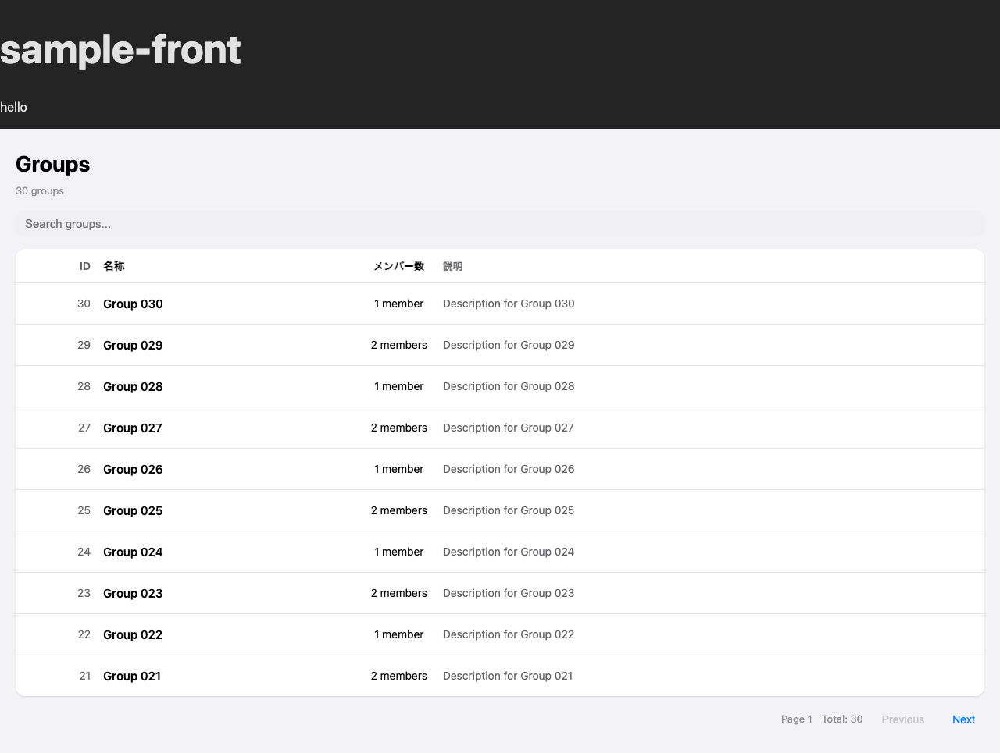

# Spec: グループ管理 - 一覧取得

## 概要

グループの一覧を検索キーワードとページネーション条件を指定して取得する。画面を開くと自動的に取得が始まり、テーブル形式で表示される。

---

## 画面



---

## 操作フロー（正常系）

```text
ユーザーがトップページを開く
  │
  ├─ グループ一覧がスケルトン表示で読み込み中になる
  ├─ バックエンドからグループ一覧を取得する
  └─ テーブルにグループ情報（ID・名称・メンバー数・説明）が表示される

ユーザーが検索ボックスにキーワードを入力する
  │
  ├─ ページが 1 にリセットされる
  ├─ キーワードで絞り込んだグループ一覧を取得する
  └─ テーブルが更新される

ユーザーが「Next」ボタンをクリックする
  │
  ├─ 次のページのグループ一覧を取得する
  └─ テーブルが更新される
```

<details>
<summary>技術詳細（エンジニア向け）</summary>

### sample-front

```text
GroupList コンポーネントがマウントされる
  │
  ├─ useEffect が fetchGroups({ search, page, limit: 10 }) を呼び出す
  ├─ レスポンスの groups を useState で保持する
  ├─ レスポンスの pagination を useState で保持する
  └─ テーブルにグループ一覧を表示する（スケルトン → データ）

検索ボックスの onChange イベント
  │
  ├─ search state を更新する
  ├─ page を 1 にリセットする
  └─ useEffect が再実行され、新しい検索結果を取得する

Previous / Next ボタンのクリック
  │
  ├─ page state を増減する
  └─ useEffect が再実行され、該当ページのデータを取得する
```

### sample-api

```text
GET /api/v1/groups?page={page}&limit={limit}&search={search} を受信する
  │
  ├─ page, limit が未指定 → 400 { "message": "Given Param is not valid" }
  ├─ page, limit が数値でない → 400 { "message": "Given Param is not valid" }
  ├─ page < 1 または limit が 1-100 の範囲外
  │    └─ 400 { "message": "Given Param is not valid" }
  ├─ GroupService.ListGroups を呼び出す
  │    └─ NG: サービスがエラーを返した場合 → 500 { "message": "エラーメッセージ" }
  └─ 200 { "groups": [...], "pagination": { "total": N, "page": P, "limit": L } }
```

</details>

---

## 処理の流れ

1. 画面を開くと、スケルトン表示でグループ一覧の読み込みが始まる
2. バックエンドの `/api/v1/groups` にページ番号・取得件数・検索キーワードを指定してリクエストを送る
3. パラメータに不備がある場合、エラーメッセージを表示する
4. 成功した場合、グループの ID・名称・メンバー数・説明をテーブルで表示する
5. ページネーション情報（現在ページ・合計件数）を表示し、ページ移動ができる
6. 検索ボックスにキーワードを入力すると、名前・説明でグループを絞り込める

---

## API エンドポイント

| 項目 | 内容 |
|---|---|
| メソッド | GET |
| パス | `/api/v1/groups` |
| 認証 | 不要 |

### リクエストパラメータ

| パラメータ | 種別 | 必須 | 説明 | 制約 |
|---|---|---|---|---|
| `page` | query | はい | ページ番号 | 1 以上の整数 |
| `limit` | query | はい | 1 ページの取得件数 | 1-100 の整数 |
| `search` | query | いいえ | 検索キーワード（名前・説明の AND 検索、スペース区切り） | - |

### レスポンス

**200 OK**

```json
{
  "groups": [
    {
      "id": 1,
      "name": "Engineering",
      "description": "エンジニアリングチーム",
      "member_count": 12
    }
  ],
  "pagination": {
    "total": 25,
    "page": 1,
    "limit": 10
  }
}
```

**400 Bad Request**

```json
{
  "message": "Given Param is not valid"
}
```

---

## 確認観点(テスト項目)

以下の 2 点を軸に確認項目を列挙する。

- **仕様を満たしているか** -- 概要・操作フロー・処理の流れに書いた内容が、実装で正しく動作するか
- **バグが発生しないか** -- 想定外の入力・操作・タイミングでも壊れないか

```text
- [ ] ページを開くとスケルトン表示後にグループ一覧が表示される                # 仕様確認
- [ ] グループの ID・名称・メンバー数・説明が正しく表示される                 # 仕様確認
- [ ] page と limit を指定してグループ一覧が取得できる                        # 仕様確認
- [ ] search パラメータで名前・説明を絞り込める                               # 仕様確認
- [ ] 検索時にページが 1 にリセットされる                                     # 仕様確認
- [ ] Next / Previous ボタンでページ遷移ができる                              # 仕様確認
- [ ] 最初のページでは Previous ボタンが無効になる                            # 仕様確認
- [ ] 最後のページでは Next ボタンが無効になる                                # 仕様確認
- [ ] page または limit が未指定の場合 400 エラーが返る                       # 仕様確認
- [ ] page が 0 以下の場合 400 エラーが返る                                   # 仕様確認
- [ ] limit が 0 以下または 101 以上の場合 400 エラーが返る                   # 仕様確認
- [ ] page / limit が数値でない場合 400 エラーが返る                          # バグ確認
- [ ] バックエンドへの通信が失敗するとエラーメッセージが表示される            # バグ確認
- [ ] 検索キーワードの連続入力で不整合なデータが表示されない                  # バグ確認
```

---

## スクリーンショット設定

```json
{
  "steps": [
    { "goto": "http://localhost:3000" },
    { "waitForText": "Groups" },
    { "screenshot": "group-list" }
  ]
}
```
