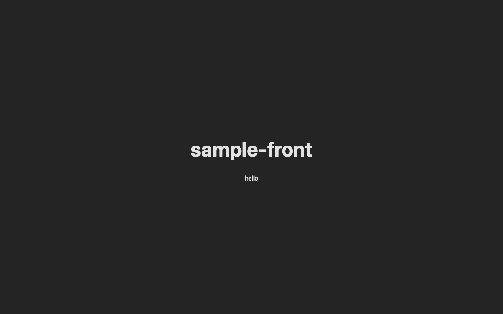

# Spec: Hello - メッセージ取得

## 概要

バックエンドから挨拶メッセージを1件取得して画面に表示する。ページを開くと自動的に取得が始まり、結果が表示される。

---

## 画面



<details>
<summary>スクリーンショット設定</summary>

```json
{
  "steps": [
    { "goto": "http://localhost:3000" },
    { "waitForText": "hello" },
    { "screenshot": "hello" }
  ]
}
```

</details>

---

## 操作フロー（正常系）

```text
ユーザーがトップページを開く
  │
  ├─ 画面に「loading...」と表示される
  └─ メッセージ（例: "hello"）が表示される
```

<details>
<summary>技術詳細（エンジニア向け）</summary>

### sample-front

```text
HomePage コンポーネントがマウントされる
  │
  ├─ useEffect が apiFetch("/hello") を呼び出す
  ├─ レスポンスの message を useState で保持する
  └─ message を画面に表示する（loading... → "hello"）
```

### sample-api

```text
GET /hello を受信する
  │
  ├─ HelloHandler.GetHello がリクエストを受け取る
  ├─ HelloService.GetHello を呼び出す
  │    └─ NG: サービスがエラーを返した場合 → 500 { "message": "エラーメッセージ" }
  └─ 200 { "message": "hello" } でレスポンスを返す
```

</details>

---

## 処理の流れ

1. ページを開くと、画面に「loading...」と表示される
2. バックエンドの `/hello` エンドポイントにリクエストを送る
3. 成功した場合、取得したメッセージ（例: "hello"）を表示する
4. 失敗した場合、エラー内容をサーモンピンク色で表示する

---

## API エンドポイント

| 項目 | 内容 |
| --- | --- |
| メソッド | GET |
| パス | `/hello` |
| 認証 | 不要 |

---

## 確認観点(テスト項目)

以下の 2 点を軸に確認項目を列挙する。

- **仕様を満たしているか** — 概要・操作フロー・処理の流れに書いた内容が、実装で正しく動作するか
- **バグが発生しないか** — 想定外の入力・操作・タイミングでも壊れないか

```text
- [ ] ページを開くと「loading...」が表示される                           # 仕様確認
- [ ] バックエンドからメッセージを取得すると画面に表示される             # 仕様確認
- [ ] バックエンドへの通信が失敗するとエラー内容が赤字で表示される       # 仕様確認
- [ ] ページリロード後も正しくメッセージが取得・表示される               # バグ確認
```
