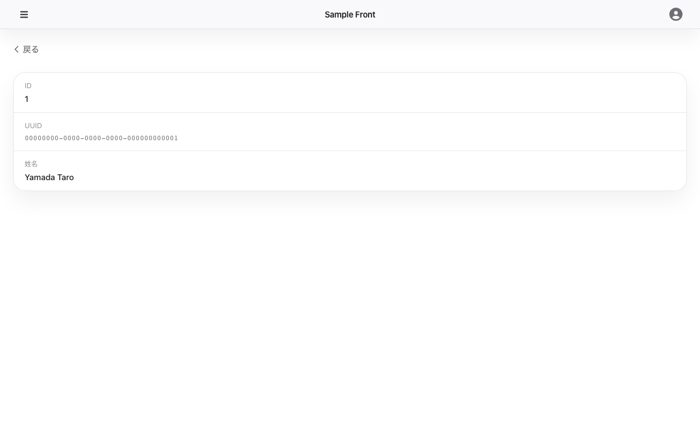

# user-detail — 画面仕様

## 目的・役割

ユーザー一覧のテーブル行をクリックしたときに表示する画面。選択したユーザーの id・UUID・姓名を確認できる。

---

## 識別情報

| 項目         | 内容                                         |
| ------------ | -------------------------------------------- |
| 画面タイトル | （タイトルなし、戻るボタンと詳細カードのみ） |
| 画面 ID      | user-detail                                  |
| URL / パス   | `/users/:id`                                 |

---

## 想定利用者

| 項目               | 内容                                                                                    |
| ------------------ | --------------------------------------------------------------------------------------- |
| 対象ユーザー       | 認証済みユーザー                                                                        |
| 必要な権限・ロール | `GET /api/v1/me` が 200 を返すこと                                                      |
| アクセス制御       | ProtectedRoute でガード済み。未認証・API 障害時は `/service-unavailable` へリダイレクト |

---

## 画面



## スクリーンショット設定

```json
{
  "steps": [
    { "goto": "http://localhost:13000/users/1" },
    { "waitForText": "00000000-0000-0000-0000-000000000001" },
    { "screenshot": "user-detail" }
  ]
}
```

---

## レイアウトと主要パーツ

| パーツ         | 役割                                                                       |
| -------------- | -------------------------------------------------------------------------- |
| 戻るボタン     | クリックすると `/users` へ遷移する                                         |
| スケルトン     | API 取得中に表示するローディング表示。`data-testid="user-detail-skeleton"` |
| 詳細カード     | id / UUID / 姓名を 3 行のラベル・値形式で表示する                          |
| 404 メッセージ | 該当ユーザーが存在しない場合「ユーザーが見つかりません」を表示する         |
| エラーカード   | API エラー時に表示する。`data-testid="user-detail-error"`                  |

---

## 操作手順

**共通（全ロール）**

1. ユーザー一覧（`/users`）のテーブル行をクリックする → `/users/:id` へ遷移する
2. ユーザー詳細が表示される（id / UUID / 姓名）
3. 「戻る」ボタンをクリックする → `/users` へ戻る

---

## ボタン・リンクの機能

| ボタン / リンク      | 操作後の動作        |
| -------------------- | ------------------- |
| 戻るボタン（← 戻る） | `/users` へ遷移する |

---

## 画面遷移

| 遷移元                    | 遷移先                    | トリガー                 |
| ------------------------- | ------------------------- | ------------------------ |
| ユーザー一覧（user-list） | この画面（user-detail）   | テーブル行をクリック     |
| この画面（user-detail）   | ユーザー一覧（user-list） | 「戻る」ボタンをクリック |

---

## 前提条件・制約

- ProtectedRoute でガードされている。`GET /api/v1/me` の認証が必要
- GroupNavigationLayout（サイドバー付きレイアウト）の外側に配置されている。サイドバーは表示されない
- URL の `:id` が存在しないユーザーの場合、「ユーザーが見つかりません」を表示する

---

## エラー・注意事項

| エラー / 注意                  | 内容                                                                    |
| ------------------------------ | ----------------------------------------------------------------------- |
| 404 Not Found                  | 該当 id のユーザーが存在しない。「ユーザーが見つかりません」を表示する  |
| 4xx / 5xx / ネットワークエラー | エラーカードを表示する。詳細は `data-testid="user-detail-error"` を参照 |

---

## 機能一覧

| 機能     | 概要                                                   | 詳細                         |
| -------- | ------------------------------------------------------ | ---------------------------- |
| get-user | ユーザー詳細情報（id / uuid / 姓名）を取得して表示する | [get-user.md](./get-user.md) |
