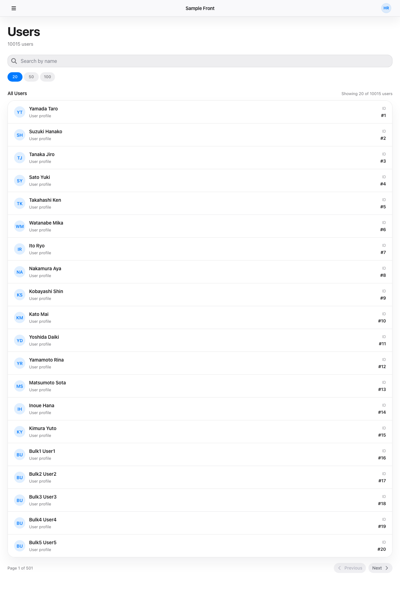

# user-list — 画面仕様

## 目的・役割

システム内のユーザーを一覧で確認する画面。検索キーワードで絞り込みができ、ページネーションで大量のデータも効率よく閲覧できる。

---

## 識別情報

| 項目 | 内容 |
|---|---|
| 画面タイトル | Users |
| 画面 ID | user-list |
| URL / パス | `/users` |

---

## 想定利用者

| 項目 | 内容 |
|---|---|
| 対象ユーザー | 全ユーザー |
| 必要な権限・ロール | 認証不要 |
| アクセス制御 | 制限なし |

---

## 画面



---

## レイアウトと主要パーツ

| パーツ | 役割 |
|---|---|
| ヒーローセクション | 画面タイトル「Users」とユーザー総件数ラベルを表示する |
| 検索ボックス | キーワードを入力してユーザーを名前で絞り込む（300ms デバウンス） |
| ユーザー一覧リスト | 姓・名をリスト形式で一覧表示する |
| 表示件数切替ボタン | 1 ページあたりの表示件数（20 / 50 / 100）を切り替える |
| Previous / Next ボタン | ユーザー一覧のページを前後に切り替える |
| ページ情報 | 現在のページ番号と総ページ数を表示する |

---

## 操作手順

> この画面は認証不要のため権限分岐なし。

**共通（全ロール）**

1. サイドバーの「Users」ボタンをクリックする → `/users` に遷移しユーザー一覧が表示される
2. 検索ボックスにキーワードを入力する → 一覧がリアルタイムで絞り込まれる（300ms デバウンス）
3. 表示件数ボタン（20 / 50 / 100）をクリックする → 1 ページの表示件数が切り替わる
4. 「Next」ボタンを押す → 次のページのユーザーが表示される
5. 「Previous」ボタンを押す → 前のページのユーザーが表示される

---

## ボタン・リンクの機能

| ボタン / リンク | 操作後の動作 |
|---|---|
| 検索ボックス（入力） | ページを 1 にリセットし、キーワードでユーザーを絞り込む |
| 表示件数ボタン（20 / 50 / 100） | 1 ページあたりの表示件数を変更する。ページが 1 にリセットされる |
| Previous | 前ページのユーザー一覧を表示する |
| Next | 次ページのユーザー一覧を表示する |

---

## 画面遷移

| 遷移元 | 遷移先 | トリガー |
|---|---|---|
| — | この画面（user-list） | サイドバーの「Users」ボタンをクリック、または `/users` に直接アクセス |
| この画面（user-list） | グループ一覧（group-list） | サイドバーの「Groups」ボタンをクリック |

---

## 入力項目

| 項目名 | 必須 / 任意 | 形式・制約 |
|---|---|---|
| 検索キーワード | 任意 | 自由テキスト。`search_key LIKE '%q%'` で絞り込み（前後スペースはトリム） |

---

## 前提条件・制約

- 認証不要。誰でもアクセスできる
- API は `offset` / `limit` / `q` パラメータで制御する。未指定の場合はデフォルト値が適用される
- クライアントは最大 500 件をまとめてフェッチしてキャッシュし、表示件数の切り替えや Previous / Next ページ操作はキャッシュから再計算する（不足時は追加フェッチを自動実行する）

---

## エラー・注意事項

| エラー / 注意 | 内容 |
|---|---|
| バックエンドへの通信失敗 | エラーメッセージが画面に表示される。一覧は空のまま |
| 検索結果 0 件 | 「No users found」がヘッダーサブタイトルに表示され、ページネーションが非表示になる |

---

## 機能一覧

| 機能 | 概要 | 詳細 |
|---|---|---|
| list-users | ユーザー一覧をページネーション・検索付きで取得する | [list-users.md](./list-users.md) |

## スクリーンショット設定

```json
{
  "steps": [
    { "goto": "http://localhost:3000/users" },
    { "waitForText": "Users" },
    { "screenshot": "user-list" }
  ]
}
```
